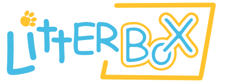

LitterBox is a static code analysis tool for detecting bugs in
[Scratch](https://scratch.mit.edu/) projects.

Bugs in Scratch programs can spoil the fun and inhibit learning
success. Many common bugs are the result of recurring patterns of bad
code. LitterBox provides checks for a collection of common bug
patterns. Given a Scratch project ID or a file, LitterBox retrieves
and parses the source code of the project, and reports all instances
of bug patterns identified. LitterBox can also check for code smells
and provide metrics about selected Scratch projects.

LitterBox is developed at the
[Chair of Software Engineering II](https://www.fim.uni-passau.de/lehrstuhl-fuer-software-engineering-ii/)
and the [Didactics of Informatics](https://ddi.fim.uni-passau.de/) of the [University of Passau](https://www.uni-passau.de).

## Building LitterBox

LitterBox is built using [Maven](https://maven.apache.org/). To
produce an executable jar-file, run the following command:

```
mvn package
```

This will produce `target/Litterbox-1.6.jar`


## Using LitterBox

To see an overview of the command line options available in LitterBox type:

```
java -jar Litterbox-1.6.jar --help
```

### Basic usage

LitterBox parses the JSON file of a Scratch project, which contains
its source code. Given such a JSON file, LitterBox is invoked as follows:

```
java -jar Litterbox-1.6.jar --check --path <path/to/project.json>
```

As a result, LitterBox will report any occurrences of bug patterns or
code smells in the project on the console.


### Downloading projects

If you want to check a specific project given its ID (which you can
find in the URL of the project), you can use the following command:

```
java -jar Litterbox-1.6.jar --check --projectid <projectid> --path <path/to/store/downloaded/project>
```

When invoked this way, LitterBox will retrieve the JSON file
automatically from the Scratch-website, store it at the given path,
and then run checks on it. Note that the Scratch project to be
analyzed has to be shared publically for this.


### Checking multiple projects

If you want to check several projects at once, you can put a list of
project IDs to check in a text file (one project ID per line) and
invoke LitterBox as follows:

```
java -jar Litterbox-1.6.jar --check --projectlist <path/to/projectidlist.txt> --path <path/to/projects>
```

LitterBox will check the given path for the projects.
If a project is not found at the given path, LitterBox
will download and store it at the given path, and then perform
the checks.

### Output options

In addition to the console output, LitterBox can produce output in
comma separated value (CSV) or JSON format. LitterBox uses the
filename specified in order to decide whether to produce CSV or JSON
output:

```
java -jar Litterbox-1.6.jar --check --path <path/to/project.json> --output <result.csv>
```

The CSV file will contain a high-level summary of the number of
different bug patterns found in the project; the JSON file will
contain a detailed list of all instances of the bug

Furthermore, LitterBox can produce an annotated version of the
analyzed Scratch-project, where all occurrences of bug patterns are
highlighted with comments.

```
java -jar Litterbox-1.6.jar --check --path <path/to/project.json> --annotate <result.json>
```


You can choose the language used for hints and comments in the JSON
and Scratch output with the `--lang` option.


### Selecting bug finders

Using the `--detectors` command line parameter it is possible to
specify which bug patterns to check for. The option takes a
comma-separated list of bug patterns, e.g.:


```
java -jar Litterbox-1.6.jar --check --path <path/to/project.json> --detectors endless_recursion,call_without_definition
```

A full list of available bug checkers can be retrieved using:


```
java -jar Litterbox-1.6.jar --help
```

To select all bug patterns, you can also use the term `bugs` in the
list; to select all code smell checks use `smells`.


### Collecting statistics

LitterBox can produce statistics on code metrics of a project (e.g.,
number of blocks, number of sprites, weighted method count):

```
java -jar Litterbox-1.6.jar --stats --path <path/to/project.json> --output <statsfile.csv>
```

### Automatically refactoring projects

Since version 1.6 Litterbox can automatically refactor a given Scratch project to improve its readability:

```
java -jar Litterbox-1.6.jar \
    --refactor \
    --path <path/to/project.json> \
    --refactored-projects <path/to/output-dir>
```

To this end, Litterbox uses a multi-objective search-based approach to explore possible
refactorings that optimize code readability metrics such as size, complexity and entropy.
The resulting set of refactored versions of the original project will be placed in `path/to/output-dir`.

### Code2Vec output

To be able to use code2vec with the programming language Scratch, Litterbox can produce a file as 
input for code2vecs machine learning. According to the description on https://github.com/tech-srl/code2vec#extending-to-other-languages,
Litterbox produces a file with exactly these rules. It's like a Scratch extractor. Litterbox needs a path to a single file or a folder with 
multiple projects and produces the output to the declared output folder.

```
java -jar target/Litterbox-1.7-SNAPSHOT.jar -c2v -output <path/to/folder/for/the/output> -path <path/to/json/project/or/folder/with/projects>
```

There are some differences between Scratch and "normal" programming languages like Java, but the most important is,
that Scratch has no methods and therefore no method names. Because of that, Litterbox uses sprite names like method names 
and creates pathcontexts from every single sprite in a project.

## Adding new bug patterns or code smells

To implement your own bug patterns, extend the `AbstractIssueFinder`
class which implements an AST visitor. The `check` method is expected
to return a set of all `Issue` instances encountered during the
traversal. Please use the `addIssue` method provided in the `AbstractIssueFinder`.

To enable the check, register it in the `IssueTool` class.
Add it to the `generateSmellFinders()` method via `registerSmellFinder(new NewFinder, smellFinders)` for smell finders or to the`generateBugFinders()` for bug finders via `registerBugFinder(new NewFinder, bugFinders)`.

Please also add the name of the finder to `IssueNames_de.properties` / `IssueNames_en.properties` and
provide hints in `IssueHints_de.properties` / `IssueHints_en.properties`, so that your finder helps programmers understand how to resolve the issue in their code to improve code quality.

## Website

We provide a website in which users can check their projects with LitterBox directly by uploading the project file or entering the project ID: [https://scratch-litterbox.org/](https://scratch-litterbox.org/)

## Publications

To learn more about LitterBox, see the following paper:

G. Fraser, U. Heuer, N. Körber, E. Wasmeier, "LitterBox: A Linter for Scratch Programs", 
in Proceedings of the IEEE/ACM 43rd International Conference on Software Engineering: Software Engineering Education and Training (ICSE-SEET) (pp. 183-188). IEEE, 2021.
[https://doi.org/10.1109/ICSE-SEET52601.2021.00028](https://doi.org/10.1109/ICSE-SEET52601.2021.00028)

To learn more about bug patterns, see the following paper:

C. Frädrich, F. Obermüller, N. Körber, U. Heuer, and G. Fraser, “Common bugs in scratch programs,” in Proceedings of
 the 25th Annual Conference on Innovation and Technology in Computer
 Science Education (ITiCSE), pages 89-95, ACM, 2020. [https://doi.org/10.1145/3341525.3387389](https://doi.org/10.1145/3341525.3387389)

To learn more about code perfumes, see the following paper:

F. Obermüller, L. Bloch, L. Greifenstein, U. Heuer, and G. Fraser, "Code Perfumes: Reporting Good Code to Encourage Learners", in Proceedings of the 16th Workshop in Primary and Secondary Computing Education (WiPSCE ’21). ACM, 2021. [https://arxiv.org/abs/2108.06289](https://arxiv.org/abs/2108.06289)

## Contributors

LitterBox is developed at the
[Chair of Software Engineering II](https://www.fim.uni-passau.de/lehrstuhl-fuer-software-engineering-ii/)
and the [Didactics of Informatics](https://ddi.fim.uni-passau.de/) of
the [University of Passau](https://www.uni-passau.de).

Contributors:

Felix Adler\
Florian Beck\
Lena Bloch\
Benedikt Fein\
Christoph Frädrich\
Gordon Fraser\
Luisa Greifenstein\
Eva Gründinger\
Ute Heuer\
Nina Körber\
Simon Labrenz\
Jonas Lerchenberger\
Stephan Lukasczyk\
Miriam Münch\
Florian Obermüller\
Gregorio Robles\
Lisa-Marina Salvesen\
Sebastian Schweikl\
Andreas Stahlbauer\
Florian Sulzmeier\
Ewald Wasmeier

LitterBox is supported by the project FR 2955/3-1 funded by the
"Deutsche Forschungsgemeinschaft" and BMBF project
"primary::programming" as part of the Qualitätsoffensive
Lehrerbildung.
